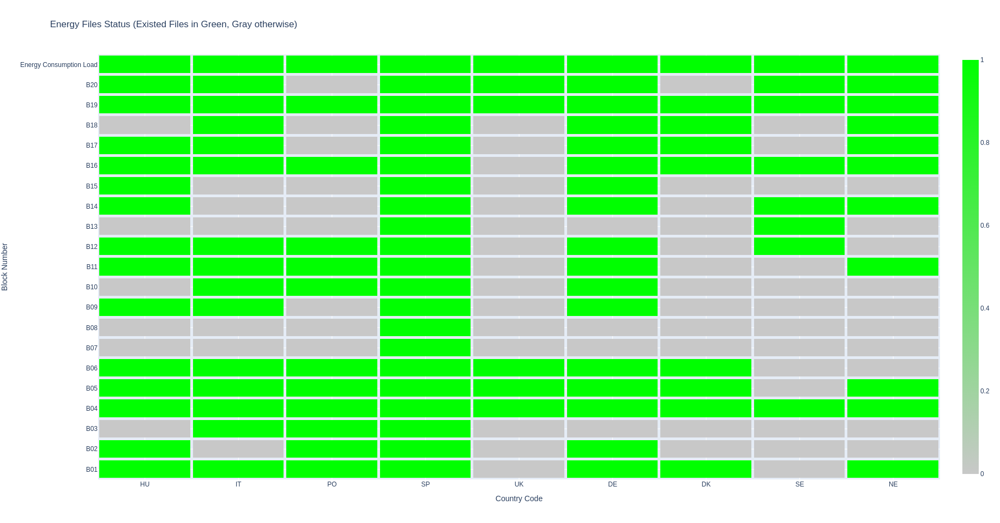

# SE-Europe-Data_Challenge_OmG-Team
OmG's repository to work with for the NUWE - Schneider Electric European Data Science Challenge in November 2023.

# Requirements 
- Ubuntu
- Python3
- libraries in requirements.txt, install them using the following command:
  - `python3 -m pip install requirements.txt`

# Run

Before running the program, you should set the following permission for the file of `./scripts/run_pipeline.sh` : 

```bash
$ chmod +x ./scripts/run_pipeline.sh
```

Now, you are ready to run the workflow by running this script file as follows:
```bash
$ ./scripts/run_pipeline.sh
```

# Monitoring

For each stage, different monitoring outputs implemented. For example, in data collection stage, 
you can see loaded blocks for each counry like the following figure:



For the "data processing" stage, OpenTelemtry used to collect telemteries like the number of missing data for each block of each country. (No missing value for quantitative columns found in the specified period, i.e., 2022-01-01 to 2023-01-01.)

For the learning stages, you can see the report of training and validation loss of the model in each step and F1-score (macro, micro, and wieghted) for predictions in console. 

# Learning Strategy

For learning, a Convolutional Neural Network (CNN) has been developed (using Tensorflow/Keras)/ 
The corresponding dataset was made by a `window_size` of data points as input features, and surplus country as the target. 
In this experimentation, the `window_size` set to 200. This window moving one step at a time over the prepared data on the segments of hours in the specified year. In total, we have 24 * 365 = 8760 datapoints comprises energy consumptions and generated green energies of all countries, and the label of the surplus country. 

As reqiured, 80% of the prepared data went for the training and 20% (0.2*8670 = 1752) went for testing of the data. 
Note that, test data has `window_size` more data as we need a window before the first test data to run the test analysis. 

Note that out of the current process, some hyper-parameters of the CNN have been tuned by BayesianOptimizarion in Keras in  a limited time. 


# Tokens:
- b5b8c21b-a637-4e17-a8fe-0d39a16aa849
- fb81432a-3853-4c30-a105-117c86a433ca
- 2334f370-0c85-405e-bb90-c022445bd273
- 1d9cd4bd-f8aa-476c-8cc1-3442dc91506d
